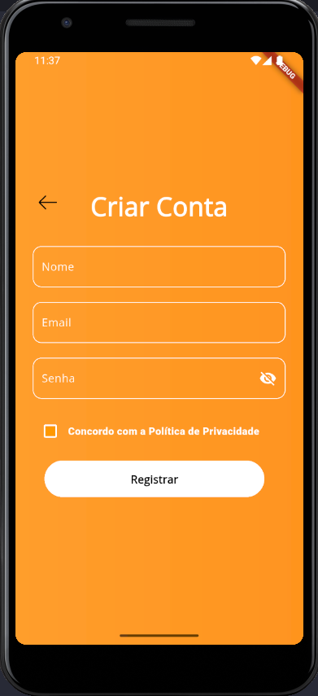

# Receita na Mão

**Receita na Mão** is an application that helps you discover recipes based on the ingredients you already have at home.  
Just list the items available in your fridge or pantry, and the app will suggest recipes you can prepare.

## Features

- Register available ingredients
- Automatic search for matching recipes
- View recipe details:
  - Required ingredients
  - Preparation steps
  - Estimated cooking time
- Favorite system to save recipes
- Ingredient usage history

## Technologies Used

- Flutter
- Dart
- Firebase (authentication and database)
- Recipe API (future integration)

## Project Status: In development
New features and improvements are being added, including external API integration and enhanced ingredient search.

## How to Run the Project

```bash
# Clone the repository
git clone https://github.com/BrandonViana/receita_na_mao.app.git

# Navigate to the project folder
cd receita_na_mao.app

# Install dependencies
flutter pub get

# Run the project
flutter run

```
## 📸 Preview  

<table>
  <tr>
    <td></td>
    <td></td>
    <td></td>
  </tr>
</table>